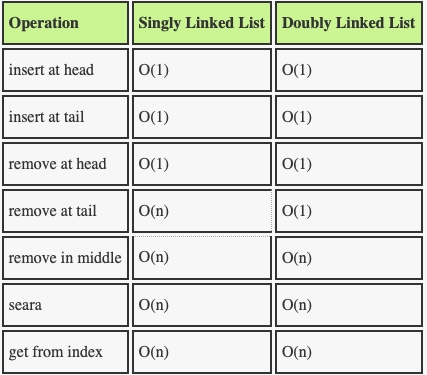

# DOUBLY LINKED LISTS

1. Doubly linked lists - work more or less like singly linked list with one difference being, that they have information about previous element in the list (so they not only know what element is next but also what element was before in the list).

2. Doubly linked lists modifying methods:

- pushing onto the end (push) - we need to add the item on the end, by changing what last element points to (to point it to our new element). Then we just need to change where the tail is pointing and add information to our node about what the previous element is. Time to add new item to the end of the linked list will be constant (even if the list would be bigger this should not affect the complexity) so the big O would be O(1) for this operation,
- removing item from the end (pop) - this operation is way simpler than in singly linked list. We have to point tail onto one before last element, set for this element 'next' property to null and set both 'next' and 'prev' in our last element to null (and decrease the length obviously). We don't have to traverse whole list so the complexity for this operation will be only O(1),
- adding item on the beginning (unshift) - we have to set the head 'prev' to point to our new node, set new node next to point to head and move head (and obviously increment the length). The complexity for this operation is also O(1),
- removing item from the beginning (shift) - we have to move the head to next item and set head's 'prev' to null. Then we can set both 'prev' and 'next' properties in our firs item to null to break the connection. The complexity here is again O(1),
- inserting element in the middle (insert) - ,
- removing element in the middle (remove) - ,

3. Other doubly linked lists methods:

- searching,
  - searching by value - to find an element we are looking for we need to traverse the linked list from beginning to the end (or from the end to the beginning, depending on from where the search operation would be quicker), so the complexity will be always O(n),
  - searching by index - looking for items by index is the same. We need to traverse whole linked list because even though we know the index we don't know where the item is, only the proceeding/next item knows it. So the complexity is also O(n),

4. Complexity comparision for basic operations in arrays and linked lists (doubly linked lists):

