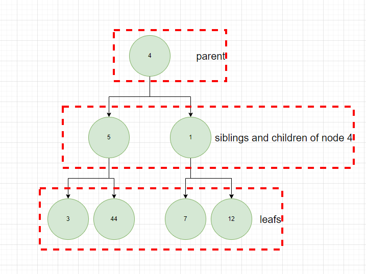
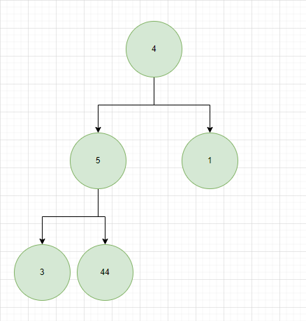
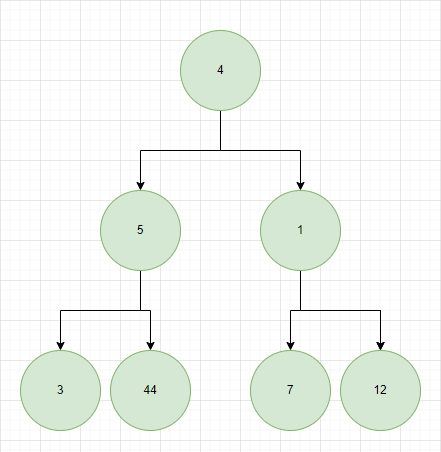
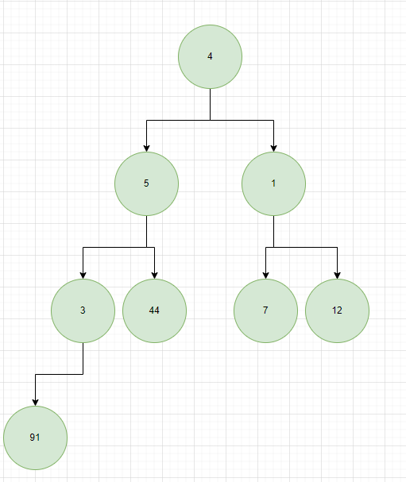
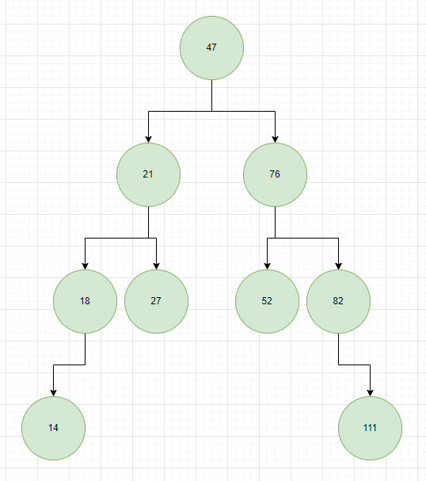

# TREES

1. Tree - tree is a data structure that represents a hierarchical tree like structure with a set of connected nodes. Linked list is a type of a tree where each node has only one branch (this type of tree does not fork). Each node in tree can be connected to many children, but must be connected to exactly one parent (except for the root node, which has no parent). The node that has connections below it is called parent (in diagram below nodes 4, 5 and 1 are parents). Nodes that are connected to parents are called children (in diagram below nodes 5, 1, 3, 44, 7 and 12). Nodes that does not have child nodes is called a leaf (in diagram below nodes 3, 44, 7 and 12). Nodes that stem from the same parent are called siblings (for example 3 and 4 would be siblings in diagram below).

2. Types of trees:

- full - where every item either points to two nodes or zero nodes,

- perfect - where every internal node has exactly two child nodes and all the leaf nodes are at the same level (below example is also a full tree),

- complete - a tree in which every level, except possibly the deepest, is entirely filled (all examples above for full and perfect are also complete),

3. Binary search tree - is a tree where the elements when added are sorted using binary search. We are checking if the element is greater then the root of the tree and then place it either on the left or right. If we have more elements in the tree we need to compare this element to root and then to all the nodes in next level (of given side) until we find an opening in the level (means a place where our new node belongs). This makes the elements in the tree sorted. We can pick any element in the diagram and compare it to the proceeding parents and it should follow the rules. For example node 27 (in diagram below) is greater then parent node 21, but is lesser then root node 47, that's why it is placed on the left side of our root and on the right side of node 21.

